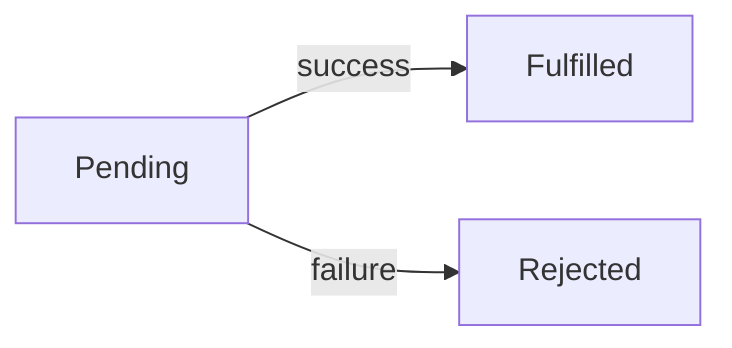

# git
- The problem
  - **Keeping track of software edits and code is very difficult**
  - Code changes all the time
  - Newly added code can break old features
  - Multiple are often adding files or editing files
- ***All software code is literally fancy text files***
  - There is nothing special about your .js file
  - It is functionally identical to a .txt file

## Git as a solution
- git is ***Version Control Software/System*** VCS
  - It is a system for making changes to files and folder and tracking those changes
  
### Keywords
- **Repository**
  - Is a folder containing files and folders
  - **Remote Repository**
    - A centralized location for files and folders
    - The remote repository is the source of truth that everyone will work off of and contribute to
  - **Local Respository**
    - A **COPY** of the remote reposity on your local machine/computer
    - You directly make changes to the local repository
      - For instance by directly editing files in VS code


### Important commands
- Copy the remote repo to your local machine
```bash
git clone https://repolocation
```


- If you make a change or add a file to your local repo you use git add .
- Puts all changes into a staging area
```bash
git add .
``` 
- if you are confident in your changes you do git commit
```bash
git commit -m "some message"
```
- if you want put your local repo version and add put it on the remote repo you use git push
```bash
git push
```
### Important Notes
- .git folder is hidden
  - Contains a record of edits and transactions
  - You never need to access this
  - Whenever you run git commands *OTHER* than git clone you want to be in the directory that has this .git folder

### Statuses
- U Untracked
  - The file is in the local repository but **NOT** in the remote repository
- A Added
  - The file is in the **staging area** in the local repository but still not in the remote repository
- M Modified
  - The file exists in the remote repository but the local version of that file has been edited
# Html

## Web Browser
- It is a desktop application
- ***ANYTHING*** on a web page, the html, the css, the JS is visible and editable by the User.
- Web Browsers are fault tolerant and try to make your web pages work even if not 100% compliant
- **Hosting** is making a piece of software publicly accesible

## The main features of a web browser
- HTML/CSS renderer
  - Ability to read .html and .css files and visually represent them
- JavaScript runtime environment
  - Allows the browser to execute JS
  - Allows dynamic webpages that responed to user actions
- HTTP Client
  - Ability to make http requests
  - Allows a browser to interact with computers on the internet

## DOM Document Object Model
- Tree map of connected html elements nodes
- A web page is made up of html elements
  - Those elements are nested
  - Those elements can be represented in a tree graph

- JS can maniulate the DOM. The original/primary purpose of JS.
  - Adding HTML elements
  - Modifying attributes on elements
  - removing elements
  - etc....

### HTML Hyper Text Markup Language
- Is ***NOT*** a programming language
  - HTML lacks the ability to perform logic
- Markup
- HTML defines the ***Content and structure*** of a web page
- HTML is made up of building blocks called ***tags*** or ***elements***
- When you navigate to a website your web browser is downloading an html file to show you


### Anatomy of an element
- Elements have an opening and closing tag
  - Some elements are self closing
- Elements have attributes
  - tags that add extra information or properties to the element
- Elements are nested but should not overlap
```html
    <!-- traditional tag -->
    <element attr="value">Content</element>

    <!-- selfclosing tag -->
    <selfclose/>

    <!-- nested -->
    <div> 
        <h6>Hello</h6>
        <h6>Hola</h6>
    </div>


    <!-- overlapping tag -->
    <div> 
        <h6>Hello</h6>
        <h6>Hola
    </div>
    </h6>

```
### Common Elements

```html
<!-- Required -->
<!Doctype html>
<html>
  <head></head>
  <body></body>
</html>


<!-- headings -->
<h1>Largest</h1>
<h6>Smallest</h6> 

<!-- text -->
<p></p>
<b></b>
<sub></sub>
<del></del>

<!-- lists -->
<ul></ul>
<ol></ol>
<dl></dl>

<!-- table -->
<table>
  <thead> 
    <tr><th></th></tr>
  </thead>
  <tbody> 
    <tr><td></td></tr>
  </tbody>
</table>

<!-- image -->

```
# Css

- Adds aesthetics and styling to a web pag
  - ***Not a programming language***
- Domain Specific Language DSL
  - A lanugage designed for one thing 
    - CSS => Styling web pages
    - SQL => Database managament
- ***Cascade Algorithim***
  - multiple css selectors will apply styling to the same element
  - The algorithim determines what is the ultimate style applied
  - *the most specific css selector wins*

### Anatomy of CSS
- Key value pair pairs called attributes
- Selectors are how you specify what element(s) the CSS styling applies to
  - id
  - tag type
  - css class

```css

selector{attribute:value}
p{background-color:red}


```
### How to add CSS to a web page
1. Apply CSS inline to an element using the `style attribute`
2. You can use the `style tag` in the head to apply styles
3. You can reference and external style sheet using the `link tag`

# Javascript

### History and Philosophy
- Most popular programming language in the world
- Was developed in 9 days
  - Has lots of quirks from a rushed design process
- Designed to be as flexible and unoppinoinated as possible
- No real relation to Java
  - Was a marketing ploy
- Was designed as a programming language to make web pages dynamic.

### Core Features
- loosely typed language
  - JS has really aggresive type coercion
- Dyanmically typed language
  - You do not have to declare the type of variables
- Very functional programming language
  - Does have support for Object oriented programming
  - Seeing classes in JS is *very rare*
- High Level Programming lanugage
  - There is no low level memory managament like pointers.
- Event Driven
  - Designed to process events as they arrive
- Single threaded
  - Unable to run tasks in parallel
- Asynchronous
  - Can run tasks in the background

### Syntax features

#### Scopes
1. global Almost never use global variables.
   1. no keyword (default scope of a variable)
2. function Scope 
   1. var
   2. NEVER use the var keyword Friends don't let friends use var
3. block scope
    1. let or const
```JavaScript
function greet(fname, lname){

    fullName = fname +" "+ lname; // fullName is a global variable. It exists for entirety of the program and anyting access it
    console.log(fullName);
}

greet("Adam", "Ranieri");
console.log(fullName); // access to the global fullName outside the function


function hola(fname, lname){

    if(true){
        var fullName2 = fname + " " + lname; // var makes the variable funciton scoped
    }
    
    console.log(fullName2);
}

hola("Rory", "Eiffe");
//console.log(fullName2);// not defined

function bonjour(fname, lname){

    let full;
    if(true){
        full = fname + " " + lname; // let is block scoped. Cannot escape the curly brackets it was defined in
    }
    console.log(full); // not defined
    const value = "Finished"; // const has the same scoping rules as let but you cannot reassign t
}
```

#### Hoisting
- JS does not read and execute code line by line
- JS has a 2 pass system 
  - The file is scanned
  - The code is executed
- Some variables are hoisted
  - They can be used before they are declared
    - functions made using the function keyword
    - variables made with var

#### Data Types
- Everything in JS is an object
- Primitive types
  1. number
  2. string
  3. boolean
  4. null
     1. Explicit assignment
  5. undefined
     1. Default value in JS
  6. symbol Almost nobody will use this
  7. bigint A new addition for massive numbers  

#### Type Coercion and Truthy Falsy
- All variables can be coerced to true or false
  - Everything is true except for the falsy values
```JavaScript
// The falsy values (they are all false because they represent nothing in a way)
console.log(Boolean(0));
console.log(Boolean(""));
console.log(Boolean(null));
console.log(Boolean(undefined));
console.log(Boolean(false));
console.log(Boolean(NaN)); // not a number
```

```JavaScript
//Loose Equality Operator
console.log(10 == "10")//true

//Strict Equality Operator
console.log(10 === "10");// false
```

#### Arrays
- Can hold any value
- Dynamically resize
- have a lot of helpful higher order functions
  - forEach
  - map
  - filter
```JavaScript
const people = ["Adam", "Bill", "Charles", "Dean"];

for(const p of people){
    console.log(p);
}

const temps = [212, 40, 0, 32, -75];
const celciusTemps = temps.map(farenheitToCelcius);

```

#### Object Literals
- 99% of JS objects are created without a class using object literal syntax
- An object is a collection of Key Value pairs
- Objects are always mutable
  - Properties can be added, changed or deleted at anytime
```JavaScript
const adam = {fname:"Adam", lname:"Ranieri", age:19, isTrainer: true};

adam.fname = "Frank"; // you can reassign the properites on an object at anytime

adam.mi = "C";// you can add a property at anytime


const tebow = {
    fname: "Tim",
    lname: "Tebow",
    universityInfo:{
        name:"University of Florida",
        location: "Gainesville"
    }
}
console.log(tebow)
console.log(tebow.universityInfo.name)
```
#### Functional Programming
- JS is functional programming lanugage
- ***FUNCTIONS ARE OBJECTS***
  - They can be dynamically crafted
  - They can be returned from functions
  - They can be passed into functions

##### Function Keyword vs Arrow Function
- Two main differences
  - `this` keyword works differently within the functions
  -  `function` keyword functions are hoisted
-  Arrow functions are **mostly** just a cleaner syntax

```JavaScript
function hello(name){
    console.log("Hello "+name);
}

const hola = function(name){
    console.log("Hola " + name);
}

//Arrow syntax
const bonjour = (name) =>{
    console.log(name)
}

const add = (num1, num2) =>{
    return num1 + num2;
}

// if your function body is a one liner. You do not need a return and curly brackets
const mulitply = (num1, num2) => num1 * num2;

//console.log(mulitply(9,10));//90

// if the function only takes in one input. the parentheses are optional
const gutentag = name =>{
    console.log("Gutentag " + name);
}
```

#### Callback Function and Higher Order Functions
- ***Callback Function***
  - A function passed as a **parameter** to another function
- ***Higher Order Function***
  - A function that accepts a callback function
```JavaScript
function isPositive(num = 0){
    return num >= 0;
}

// callback function -> isPositive
// higher order function -> filter
const positiveTemperaturs = temps.filter(isPositive);
```

##### Closures
- Functions are *always* able to access variables that are in scope when the function is created.
- If you return a function that uses a variable that was defined previously it is considered enclosed

```JavaScript
function Car(){

    let mileage = 0;

    function driveCar(miles){ // functions are created dynamically. With the variables they point to dependent on when it was executed
        mileage += miles; // mileage is the enclosed variable
        console.log("The mileage is now "+mileage)
    }

    return driveCar;
}

const driverCar1 = Car();
driverCar1(200)// prints 200
driveCar1(300)// prints 500
```
# HTTP
# HTTP Hyper Text Transfer Protocol
- It is the main way of sending information on the web
  - The definition of a a web application is that it uses HTTP communicate
- HTTP is a request Responese based system
  - ***Client***
    - Person or browser or piece of software that makes an ***HTTP Request***
  - ***Web Server***
    - Computer or application that responds to an HTTP Request with an ***HTTP Response***
    - information and files are stored on web servers

### Anatomy of an http request and Response

##### Request
- Version of HTTP it is using
  - Pertinent if you get trapped in a time loop to the early 2000's
- URL
  - Uniform Resource Locator
  - Wherever the HTTP request is going
- Verb
  - The of HTTP request
  - The verb describes what the request is *supposed* to do
    - get
      - Get or read information back from a server
    - post
      - Send information to a server to create somthing
    - put
      - Send information to update something on a web server
    - delete
      - Send information to delete something on a web server
- Body (optional)
  - The information you are sending with the request
- Headers
  - Key value pairs that are *meta information* about the request
    - Authentication is a big example

##### Response
- Status Code
  - How a request was handled by a web server
    - 100's
      - Information
    - 200's
      - Successfully completed the request
    - 300's
      - Redirected
    - 400's
      - Client makes a mistake in sending the request
      - 403
        - forbidden
        - You do not have access
      - 404
        - Not found
      - 405
        - unauthorized
        - You are not logged in
      - 415 
        - No teapot
      - 451
        - Not avaiable due to government censorship
        - named after the book Farenheit 451
    - 500's
      - Server encounters an error when processing the request
- Body
  - Information sent back in the request
    - String
      - JSON
    - File
      - Html
      - CSS
      - JS
- Headers
  - Key value pairs that are meta information for the response
  

## JSON JavaScript Object Notation
- String version of a JavaScript Object
- Why do JSONs exist?
  - Web Servers can be written in any language
  - Web Servers need to be able handle HTTP requests
    - Web Browsers are the biggest HTTP client in the world
  - If you are sending data to a Python Web Server python would have no idea what to do
    - If a python web server sent back a Python object to the web browser as the HTTP response
      - The JS in the browser would have no way to use it
- There was one data type that just about every programming language supports.
  - ***Strings***
  - Strings are supported by almost programming language
  - Programming languages can parse JSONs into their own specific objects for that language
- JSONs are for transporting and storing data
  - ***Reading and writing JSONs will be a huge skill that you learn***
  - functions are excluded when an object is turned into a JSON
    - A python application would have no way of running a JS function
    - JSONs are for passing **data** not **code**

- Many web servers DO NOT return HTML or CSS.
- They return JSONs
  - Just data
- Web Servers that send and recieve JSONs have an ***API***
- Application Program Interface
  - The API of a web server is the part of the `application` that you `interact` with `programatically`
    - Programatically means making HTTP request with a programing language


## Asynchronous Operations async await
- Real life Example
  - If you are hosting a party their are several things you have to do
    - Clean up the living room
    - Put drinks in the fridge
    - Order a pizza to be delivered
      - Pizza arrives asynchronously
    - Put out plates for everyone
    - Put the game on the TV.
- HTTP requests are like ordering a pizza
  - The reponse could take a long time to get back to the browser
  - We can use a special `async` `await` to wait on snippets of code that execute asynchrously
    - A ***Promise*** is a wrapper around a value that can be awaited.
    - A promise represents a value that will eventually exist
      - A promise is `fulfilled` if the value in the promise is completed without error
      - If the value in the promise cannot be completed then an Error is put in the promise and is considered `rejected`
  - Promise Life cycle

# Typescript

## Problem
- JS has *a lot* of issues
  - type coercion leads to unexpected types
  - There is a lack of intellisense when coding JS
    - Beacuse technically anything goes in JS
  - really easy to call functions with incorrect parameters or the wrong types
  - lack errors
    - values just being undefined and hiding the program
- JS is the only langauge supported in web browsers

## Solution
- Create a language that has the the type checking developer friendly validation
  - The language ***Transpiles*** itself into JavaScript
- ***TypeScript***
  - A statically typed version of JS
  - TypeScript and be transpiled into JS

### Features of TypeScript
- Static typing
  - can create variables of a certain type
  - can define return values
  - define generics for things like arrays
- Transpile into any version of JS
  - You can write code in the most modern syntax available and target old versions of JS
  - example
    - Write using TS classes and write a functionally equivalent version for ES3 that came out in 2006
- Has a lot more OOP
  - access modifiers
  - Classes before ES6
    - TS is from 2012
- ***Superset of JavaScript**
  - *any valid JS is valid TS*
  - TypeScript has additional features
- TypeScript is a **configurable programming language**
  - you voluntariliy opt in to certain features or syntaxes on a per project basis
  - ***tsconfig.json***
    - The file responsible for setting the options when you transpile a TS file into a JS file
- the `tsc` command will use the tsconfig.json to transpile all the TS files in the project into runnable JS
# React
# JAVA

## Java basics

### concepts about the programming language

- Object-Oriented - structured around classes and their objects
- It was developed by James Gosling and his team at Sun Microsystems in the mid-1990s, and is now owned by Oracle Corporation.
- Rich APIs (e.g. Collections API) (Collections)
- Write Once Run Anywhere
    - which means that Java code can be written once and run on any platform that has a Java Virtual Machine (JVM) installed, without the need for recompilation.
- strongly typed(have to declare int, char)
- Automatic garbage collection
    - simplifies memory management, eliminating the need for manual memory allocation and deallocation. 
- verbose
    -lots of lines of code

### compilation process
- The .java file is passed to the javac java compilier from the JDK(Java development kit)
- into Bytecode (.class low level representation of Java code that  can be executed by JVM in any mchine that has JVM)
1. Class-Loader - loads all classes that are used in the program
2. Bytecode verifier - checks that bytecode and makes sure that it doesn't have damaging instructions (ex: using a variable before it's initialized)
3. Just-In-Time Compiler convert bytecode into machine code


### JDK
- Java Development kit
    contains JRE(Java runtime Environment) which then contains the JVM(Java Virtual Machine)
    - JRE: software package that provides the minimum set of resources necessary to run Java applications on a computer system
    - JVM: interpreter that executes Java bytecode

- IDE - Interactive Development Environment
    - IntelliJ (Recommended) - Community edition is fine for our purposes
        - Create associations with .java file
        - Add bin to path
    - Eclipse
### Packages
- Like folders/directories
- We also specify which package each class is in
- Packages help us determine what variables can and can't be accessed

### Main Method
- The starting/entry point for our class
- Key words
    - public - call this method from anywhere in the program
    - static - the method is associated with the class rather than an instance (this is good because we wouldn't to be required to create an instance of this class before we call the main method)
    - void - doesn't return anything
- Parameters
    - String [] args - an array of strings which indicate that arguments that we pass in to our program
        - If we run our program from the command line, we can pass in additional arguments to use in the program
- Body - what runs when we execute the program
    - this can call other methods

``` Java
class HelloWorld{
    public static void main(String args[]){

    }
}
```

### Primitive Types:
- any type that isn't a class
- char - letter/symbol ('a', '2', '$')
- int - whole number
- byte, shorts - whole numbers with a lower range than int
- long - whole number that has a higher range than int
- doubles/floats - a number with decimal places (doubles have more precision than floats)
- boolean - true/false values
- In order from smallest to largets: boolean, byte, short/char, int/float, long/double
- Most commonly used: int, double, boolean, char
    - Sometimes use longs if we want guaranteed larger range

### String
- Declaring String with the new keyword vs the primitive-esque assignment
    - String s = new String("Hello");
        - This is how we normally declare classes
        - This does not leverage the String pool
        - All strings created with the new keyword have their own spot in memory
    - String s = "Hello";
        - String pool
            - A way to save memory by using the same memory locaiton for identical strings
            - If we declare 3 different strings all with the same value (ex: "Hello"), only one instance of that string will be created in the String pool
            - Each of those variables will reference the same exact location
            - Strings are immutable in Java, we can't change the String itself
                - This makes sense because changing the memory would affect all references to that same String
        


### enhanced for loop
- similar to python
``` Java
for (int i: arr){
    //do this
}
```
### Scopes:
- method - a variable that we declare in a method won't be accessible from outside the method
- block scope - a variable declared in a block can't be accessible from outside
    - this is useful with for loops because it lets us redeclare the int i counter for every for loop
- Static/Class scope - method/variable is tied to the class itself. Class variables are initialized automatically to default values when the class is loaded, and they can also be explicitly initialized in a static block.(example: Calculator.PI)
- Instance/Object scope - variables that are attached to the particular instance (example: animal.species)

### Access Modifiers:
- Access modifier is a keyword that we apply to a method, class, variable that indicates where in the program it can be accessed
- public - it can be accessed anywhere in the project (no matter what package it's in)
- private - it can only be accessed within that same class
    - methods can only be called from other methods in that class
    - variables can only be accessed by methods in that class
- default - accessible within the same package
    - The tricky part is that we don't actually declare anything as default
    - "Default" in this case means we don't give an access modifier
- protected - accessible within the same package and sub-classes
    - can apply to methods and variables

### Non-Access Modifiers:
- These are modifiers that don't affect our access to the methods/variable/class
- abstract
    - apply to class to make it possible to have abstract methods
    - apply to method to make that method abstract (we don't need a method body)
    - In Java, an abstract class is a class that cannot be instantiated, meaning that you cannot create an object of the class directly. Instead, an abstract class is intended to be subclassed, meaning that it provides a template for other classes to inherit from.

    ``` Java
    public abstract class Shape {
   public abstract double area();
   public abstract double perimeter();
    }
    ```
- static
    - Scopes the method/variable to the class rather than an instance
        - ex: A calculator class, we could have a static field for PI because PI will not vary depending on which instance we have
        - We use the static keyword on our main methods because we don't actually need an instance of our class to run them
    - We can't call non-static methods or access non-static variables from a static context/method
    - We CAN call static methods and access static variables from a non-static/instance method
- final
    - 3 different contexts:
        - If we apply it to a variable, it means we can't reassign it
            - If we have an object declared as final, we can reassign the fields
        - If we apply it to a method, we can't override it
        - If we apply it to a class, we can't extend it

### This keyword:
- We use the "this" keyword in our methods to indicate that we want this particular instance's field or method
```java
class Animal {
    String name;

    
    public Animal(String nameInput) {
        // the "this" keyword denotes that we want to access the instance's name field rather than the parameter that we passed in:
        this.name = nameInput;
    }
}

```
## SUper
- "super" is a keyword that is used to refer to the parent class of a subclass. 

``` Java
public class Car extends Vehicle {
   private int numWheels;
   
   public Car(String make, String model, int numWheels) {
      super(make, model); // call parent constructor
      this.numWheels = numWheels;
   }
}

```
### == vs .equals()
- The "==" operator compares the reference identity of two objects, meaning that it checks whether the two variables point to the same object in memory.
- On the other hand, the ".equals()" method compares the content equality of two objects, meaning that it checks whether the two variables have the same value or state.

### arrays 
``` Java
        // Arrays in Java are statically-sized:
        // meaning we can't change the size and we can't push new elements on
//        arr.length = 6;
//        arr.push("New Word");

        // we can instnaitate an array like this
        int [] numbers = {1,2,3,4,5};

        // instantiate a new array of size 10 with all empty slots:
        boolean[] booleans = new boolean[10];
        booleans[5] = true;
        for(int i = 0; i < booleans.length; i ++) {
            System.out.println(booleans[i]);
        }
```

## OOP

### Abstraction
- Hiding the details of our implementation
- For example, we define the expected output/input/general behavior in a parent class but leave the specific implementation up to a child class
- In Java, we can achieve abstraction in 2 ways:
    - Abstract class
        - concrete methods have a body and actual code
        - Can have concrete and abstract methods
        - You can't have abstract methods in a concrete class
        - If we extend an abstract class, we either have to declare it as abstract or fill out the methods
        - We cannot instantiate an abstract class
        - IntelliJ shortcut: Right-Click + Generate + Implement Methods + Select methods that you want to override (taken from the parent class)
    - Interface
        - An interface is totally abstract (no concrete methods*)
            - Exceptions are default and static methods
        - An interface only has abstract methods and must be *implemented* instead of extended
- Example:
    - Shape has abstract area method which is filled out in child classes

### Encapsulation
- We take properties/methods and "encapsulate' them into one related class, or one unit
- For example, making a car class with properties (speed, color, milage)
- Hiding our members using access modifiers
    - Example: making our variables private and using public getters/setters to access them
        - Gives us more control to the underlying data

### Inheritance
- Parent-child relationships
- We've seen this with the Object class in that every class in Java inherits from that class meaning it has all of the parent's methods and fields
- If a child extends a parent class, it will have access to all of the fields and methods that the parent can have
    - We can change how the methods work in the child (Overriding), we can also add new methods and fields
- Open for extension, closed for modification
- Animal -> Mammal -> Cat/Dog
- 

#### Types of Inheritance
- Single - Class A inherits from B
- Multilevel - Class A inherits from B which inherits from C, etc.
- Hierarchical Inheritance - one parent can have as many children as they want
- Multiple Inheritance (NOT ALLOWED IN JAVA*) - one class extending many parents
- Hybrid (NOT ALLOWED IN JAVA) - combination of multiple and hierarchical
- Key Takeaway: One class cannot inherit multiple parents
- The exception to the Multiple and Hybrid rules is that we can implement multiple interfaces
    - We just have to implement all abstract methods we get from every interface (unless the class that's implementing is abstract)
    - See Flying Fish Example (Tuesday.OOP.Inheritance.interfaces)

### Polymorphism
#### Run-Time (Dynamic) Polymorphism
- Overriding - overriding what the parent method defined with the child implementation

```Java
class Animal {
    public void makeSound() {
        System.out.println("Some sound");
    }
}

class Cat extends Animal {
    @Override
    public void makeSound() {
        System.out.println("Meow");
    }
}
```
- For a given class, we can only override a method once
- Inheritance and overriding
- When we override a method from a parent class, this is an example of polymorphism
- poly - many
- morphism - forms
- Same method signature (same name, same parameter, return types)
    - But in the sub-class we change the body of the method
#### Compile-Time (Static) Polymorphism
- Overloading
    - different number of parameters
    - different types of parameters
    - different order of parameters
    - key takeaway: as long as two methods don't have the exact same sequence of parameter types, it's a "valid" overload
- 2 or more methods with similar declaration (same name, but different parameters)
- We can overload a method as many times as we want, as long as we keep giving different parameters

```Java

public class OverloadingExample {
    public static int add(int a, int b) {
        return a + b;
    }
    
    public static double add(double a, double b) {
        return a + b;
    }
```

## Streams
``` Java
// mapping them to the squares of the original number and then returning a list
        List<Integer> squares = numbers.stream().map(x -> x * x).collect(Collectors.toList());
        System.out.println("Squares:" + squares);

        // filter and keep the evens and then sort:
        List<Integer> evens = numbers.stream().filter(x -> x % 2 == 0).sorted().collect(Collectors.toList());
        System.out.println("Even: " + evens);

        evens.stream().forEach(val -> {
            System.out.println("This is the forEach: " + val);
        });

        //                     start at 0, at each step, we add 1 to accumulated value:
        int numEven = evens.stream().reduce(0, (ans, current) -> ans + 1);
        System.out.println("Number of even numbers: " + numEven);


        int sumEven = evens.stream().reduce(0, (accumulator, current) -> accumulator + current);
        System.out.println("Sum of all even numbers:" + sumEven);

        int productEven = evens.stream().reduce(1, (accumulator, current) -> accumulator * current);
        System.out.println("Product of all even numbers:" + productEven);


        List<Integer> cubed = numbers.stream().map((x) -> x * x * x).collect(Collectors.toList());
        System.out.println(cubed);
```

## COllections

- Arraylist vs linked list
``` Java
// ArrayList is an implementation of the List interface
        // pass in the type that we want to store in the <>:
        List<String> names = new ArrayList<>();
        List<String> names2 = new LinkedList<>();

        names.add("Rory");

        // .iterator returns an iterator that points to the list:
        Iterator<String> iterator = names2.iterator();
        // .hasNext tells us if there is another element that the iterator points to:
        while(iterator.hasNext()){
            // .next advances the iterator and returns that next value:
            String name = iterator.next();
            System.out.println(name);
        }
```

## Generics

- Generics allow you to define a class, interface, or method that operates on a parameterized type. By using generics, you can create reusable code that can work with different types of objects without having to write the same code multiple times for each type.

```Java
public class Box<T> {
    private T contents;

    public void set(T contents) {
        this.contents = contents;
    }

    public T get() {
        return contents;
    }
}

```
```Java
Box<String> stringBox = new Box<>();
stringBox.set("hello");
String str = stringBox.get();

Box<Integer> intBox = new Box<>();
intBox.set(42);
int i = intBox.get();

```
- useful for lots of types

## Java 8

### Lambda expressions
- parameter -> expression
    - takes in a single value and returns a single expression
- (parameter1, parameter2) -> expression
    - takes in multiple parameters and returns an expression
- (parameter1, parameter2) -> {code}
    - takes in multiple parameters and executes some code
``` Java
names.forEach(name -> System.out.println("Hello, " + name));
```

### Functional interface
- defined a functional interface named Calculator that takes two int parameters and returns an int value.  this interface is intended to be used as a functional interface, which means it should have exactly one abstract method.

```Java

public interface Calculator {
    int calculate(int a, int b);
}

```

```Java
Calculator adder = (a, b) -> a + b;
Calculator subtractor = (a, b) -> a - b;

int sum = adder.calculate(2, 3); // sum = 5
int difference = subtractor.calculate(5, 2); // difference = 3

```
- We can use these to store lambda expressions
    - When we write lambda expression, we want to adhere to the method signature of the FI

- Built-In Functional Interfaces:
    - Consumer - takes in a value and doesn't return anything
        - ex: take in a string and print it out
    - Predicate - takes in a value and returns a boolean
        - ex: takes in a number and returns even/odd
    - Function - takes in a value and returns a value
        - square/cube function that takes in an integer and returns an integer squared/cubed
    - Supplier - doesn't take in a value but does return a value
        - ex: returns a random number
    - Bi-Versions -  
        - BiConsumer takes in 2 values
        - BiPredicate takes in 2 values
        - BiFunction takes in 2 values

## Error handling

- error vs exception
    - we can handle exceptions

``` Java
try {
            // because this constructor tries to create a file reader based on a file that might
            // not even exist, we have to handle the checked exception (FileNotFound) before we can run the program
            FileReader file = new FileReader("tst.txt");
            System.out.println("File found");
            System.out.println(numbers[100]);
        }
        catch(FileNotFoundException exception) {
            System.out.println("File doesn't exist :(");
        }
```
- throw

``` Java
    // if we make this helper throw an exception, that is propogated to where the
    // method is being called from
    public static void helper() throws FileNotFoundException{
        FileReader file = new FileReader("test.txt");
    }
```

## Design patterns

- Singleton pattern - ensures that only one instance of a class is created and provides a global point of access to it.
- Factory pattern - provides a way to create objects without exposing the creation logic to the client and refers to the newly created object through a common interface.

## Maven

- Build automation tool
    - helps us build our projects, incorporating all of the dependencies we needs (such as JUnit)
    - We use it for JDBC (Java Database Connectivity) as well

### POM - Project Object Model
- Contains metadata like name, version, etc.
- A list of dependencies or external libraries that we're working with
- Whenever we want to add a new dependency, we just update the pom.xml and sync the project
    - In IntelliJ, we should see a blue circle icon to sync

### JUnit
- a framework in Java that lets us write unit tests for our code
- testing our program in the smallest increments/pieces as possible
- In Java we usually write unit tests that test a particular method
    - Given some input, make sure it returns the correct output
- JUnit is an external dependency, we can't access it without first installing it

### Annotations (Jupiter Annotations)
- @Test - we use it to annotate methods, indicating that the method is testing something (usually a method from main directory)
- @BeforeAll - we use it on a static method, to indicate that it should run before all the tests in that class are run
    - We can use this to do any set up we need at the beginning of all testing methods of that particular class
- @BeforeEach - we annotate a non-static method to indicate that this method should run before every test
    - initialization before each test (ex: maybe resetting a value)
- @AfterAll - clean up after all tests are run
- @AfterEach - clean up after each individual test

### Junit vs Jupiter
- Instead of BeforeEach, we get Before in JUnit
- Instead of BeforeAll, we get BeforeClass in JUnit
- In JUnit we can use Assert.assertEquals (or any of the assert methods)

### Testing Methods
- assertEquals - ensure that 2 values are equal, otherwise the test fails
- assertTrue - ensures that the value returns true
- assertArrayEquals - ensures that 2 arrays have the same length and the same values
- https://junit.org/junit5/docs/5.0.1/api/org/junit/jupiter/api/Assertions.html

``` Java
public class CounterTest {
    // set up a Counter object that we can use in our tests
    static Counter counter;

    @BeforeClass
    public static void setUp() {
        // only initialize the counter once
        counter = new Counter();

    }

    @Before
    public void init() {
        // reset the counter back to 0:
        counter.reset();
    }

    @After
    public void cleanUp() {
        System.out.println("Clean up");

    }

    @AfterClass
    public static void cleanUpClass() {
        System.out.println("Clean up after class");

    }

    @Test
    public void testGetValue() {
        // assert just takes in a boolean and asserts that it's true
        Assert.assertEquals(0, counter.getValue());
    }

```
### Test-Driven Development (TDD)
- Writing tests before we write our code
- Benefits
    - Helps us write good code
        - Identify edge cases
        - Helps to point out awkward method declarations
        - Identify areas to improve
    - Nice workflow and lets us see tangible progress as we fill out our methods

### Testing Scenarios
- When applicable, we want to test both the positive case and negative case
    - ex: we have a method that returns whether a value is even or odd
        - We would want at least 2 tests to test the positive and negative case
    - Code Coverage - a measure of which lines of your code are being run when you test
        - let's say we have an if/else statement, we would want to make sure we have test cases that cover both possible scenarios in order to get the most coverage
        - IntelliJ lets you see coverage by right-click and run tests with coverage
        - Testing a folder/package will test everything in that folder
            - We can also just test a class
            - We can also just test a method
- When testing methods that accept some sort of collection of data
    - empty collection
    - collection with exactly 1 element
    - collection with 2 or more

# SQL

- React for front-end
- Java for back-end server that accepts requests and sends responses
- Once we stop Java program, all of the data/variables we created are going to be wiped
    - We saw this with the GraphQL server where the data wouldn't persist between restarting our server
- So we need a solution that lets us store our data permanently and doesn't get wiped when we stop our server
## basic concepts
- Databases are a way to store data and persist it permanenty
- SQL - Structured Query Language
- Structrured - we define rigorous rules for what our data looks like
    - Store our data in tables
    - Each table has rows and columns
    - Columns have specific rules about what data can go inside (data types (numbers vs strings, etc.), constraints (non-null))
    - Goes well with Java because we use classes to structure our objects
        - See some similarities between Java Classes and SQL tables
    - 
- Query - 
    - Lets us write detailed queries so we get exactly the data that we want
        - ex: we want all pets older than 6 who are dogs
        - ex: all dogs with brown fur that aren't adopted
        - ex: person with id 1

## Dialects
- postgreSQL and mySQL are examples of dialects
- Each dialect has different syntax but should have the same functionality
- DO NOT mix up dialects with sub-languages

## Keys
- Primary Key
    - all values in the table are unique
    - no null values
    - Good for identifying a particular record
    - ```create table pets (id serial primary key);
    - Distinction is that primary key is not the same as serial
        - serial allows for the auto-increment ability of the column
        - primary key ensures uniqueness and non-null
- Foreign Key
    - this lets a column of one table refer to another
    - we need at least 2 tables
    - Usually a field of one table will reference the primary key of another

## Types of Multiplicity Relationships:
- One-to-One
    - One person has one SSN (Social Security Number)
    - One SSN belongs to one person
    - Could have a field SSN
    - Could also have 2 tables that reference each other
        - Person references SSN table
        - SSN table references person
- One-to-Many
    - One person can own many pets
    - One pet cannot belong to many owners
    - In SQL, represented by a column of one entity referencing the primary key of another
        - ex: owner_id from pet table references the primary key of the person table
- Many-to-Many
    - One person takes many classes
    - One class can have many people taking it
    - In SQL, we need 3 tables
        - Person table (entity)
        - Class table (entity)
        - Person_Takes_Class
            - person_id references person
            - class_id references class
        - An entry in this table indicates that that person takes that class

## Sub-Languages
- a way to sort SQL commands based on what they're doing (creating tables, mutating data, querying data, etc.)
- DDL - Data Definition Language
    - Creating tables, altering tables, setting up the structure of our data
    - Commands:
        - CREATE - create a table/database
            - when we create a table, we have to specify the columns, fields, etc.
        - ALTER - changing a table
            - rename, add columns, update columns, add constraints, delete columns
        - DROP - drop a table/database
            - drop/remove the table/database from existence
        - TRUNCATE - removes data from table
            - wipes the data from a table but keeps the table
    - ``` CREATE TABLE pets (name VARCHAR(50), age INTEGER);```
    - Drop - drops the whole table/database
    - Truncate - deletes the data from the table
    
    - truncate is the same as delete with no where clause
- DML - Data Manipulation Language - updating the records of the table
    - INSERT - inserts a new record to the table
    - UPDATE - updates a pre-existing record(s)
    - DELETE - deletes a record(s) from the table
- DQL - Data Query Langauge
    - Commands:
        - SELECT - selectes/reads data from a given table
- TCL - Transaction Control Language
- DCL - Data Control Language

## Data Types
- INTEGER - like an int in Java, store whole numbers
- FLOAT - like a float/double in Java, store decimals
- SERIAL - like an integer but lets us use the default keyword to auto-increment the value
    - we should use this for id fields
    - when we insert into the table, we should pass in default as the id to let the database generate the new id
- VARCHAR - like a string in Java
    - we declare it with the number of characters in a single value, I use 50 as default
- date - store a date with month day and year
    -  '1970-01-01'
- timestamp - includes a date as well as a time
    - '2016-06-22 19:10:25-07'
- boolean - true/false
- List of data types: https://www.geeksforgeeks.org/postgresql-data-types/ 